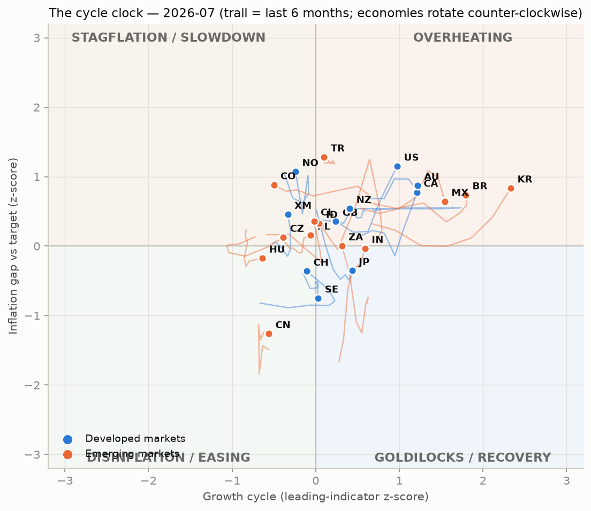
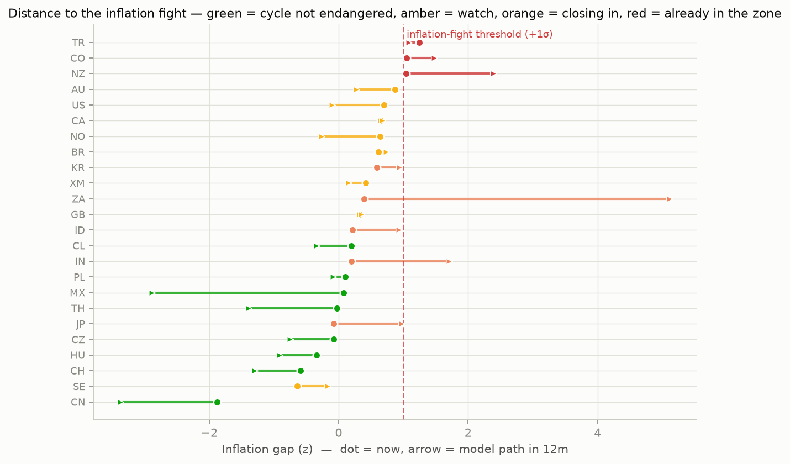
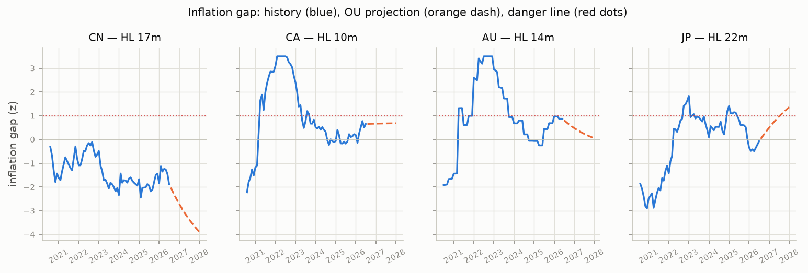
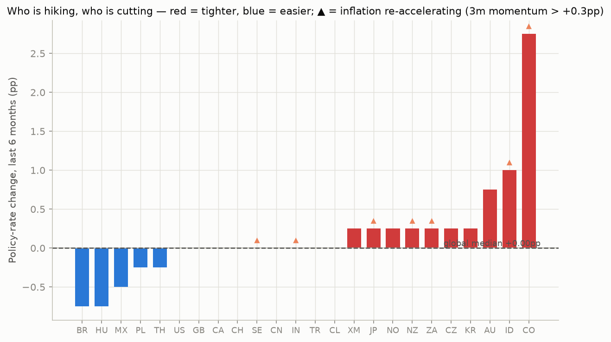
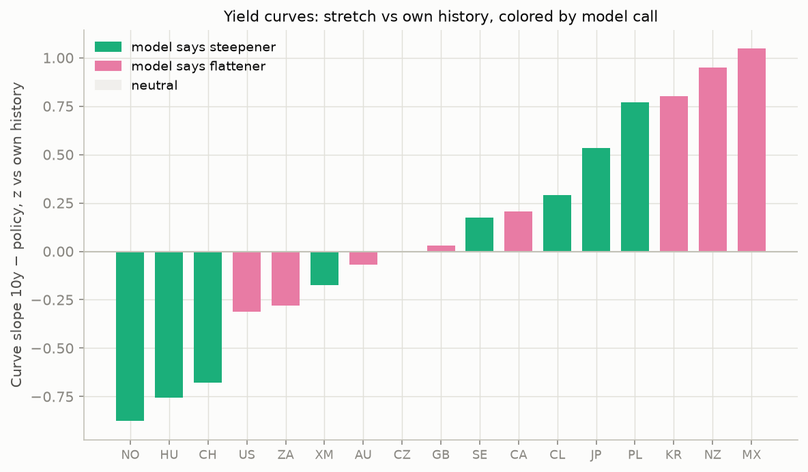
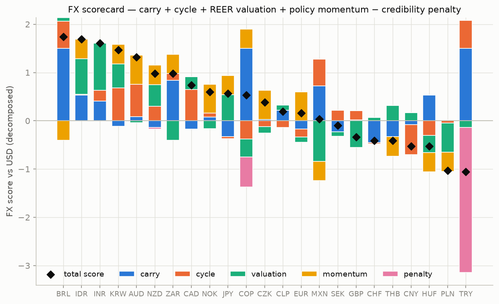

# DM + EM Cycle Monitor — 2026-07

*Generated 2026-08-28 by CycleAnalyzer. Data: BIS (policy rates, CPI, REER), OECD (composite leading indicators), FRED (10y yields). All signals are model output, not investment advice.*

**At a glance — the plays (elaborated in §6):**
1. Mexico curve flattener (pay the belly vs the wings or outright 10y−policy)
2. Long BRL / short PLN
3. The fresh signal: India
4. The quiet carry: long MXN, because its cycle is not endangered
5. The reckoning trade: New Zealand front end is mispriced

## 1. Where the world is on the clock

The global pack: **5 central banks easing, 9 on hold, 10 hiking** — median policy move over 6 months +0.00pp.

**Overheating**: 11 · **Stagflation**: 6 · **Goldilocks**: 3 · **Disinflation**: 3

| Economy | Bloc | Growth z | Infl z | Phase | Heading | ETA next |
|---|---|---|---|---|---|---|
| Euro area | DM | -0.3 | +0.5 | **Stagflation** | ← Overheating | ~16m |
| Norway | DM | -0.2 | +1.1 | **Stagflation** | ← Overheating | ~4m |
| United Kingdom | DM | +0.2 | +0.4 | **Overheating** | → Stagflation | slow |
| New Zealand | DM | +0.4 | +0.5 | **Overheating** | ← Goldilocks | ~41m |
| United States | DM | +1.0 | +1.2 | **Overheating** | ← Goldilocks | ~5m |
| Australia | DM | +1.2 | +0.9 | **Overheating** | ← Goldilocks | ~12m |
| Canada | DM | +1.2 | +0.8 | **Overheating** | → Stagflation | ~17m |
| Japan | DM | +0.4 | -0.4 | **Goldilocks** | ← Disinflation | ~4m |
| Sweden | DM | +0.0 | -0.7 | **Goldilocks** | → Overheating | ~34m |
| Switzerland | DM | -0.1 | -0.4 | **Disinflation** | → Goldilocks | ~3m |
| Czechia | EM | -0.4 | +0.1 | **Stagflation** | → Disinflation | ~11m |
| Colombia | EM | -0.5 | +0.9 | **Stagflation** | → Disinflation | ~7m |
| Poland | EM | -0.1 | +0.2 | **Stagflation** | → Disinflation | ~21m |
| Chile | EM | -0.0 | +0.4 | **Stagflation** | → Disinflation | ~4m |
| Turkiye | EM | +0.1 | +1.3 | **Overheating** | ← Goldilocks | slow |
| Indonesia | EM | +0.0 | +0.3 | **Overheating** | → Stagflation | ~1m |
| Mexico | EM | +1.5 | +0.6 | **Overheating** | ← Goldilocks | ~5m |
| Brazil | EM | +1.8 | +0.7 | **Overheating** | ← Goldilocks | ~4m |
| Korea | EM | +2.3 | +0.8 | **Overheating** | → Stagflation | ~20m |
| South Africa | EM | +0.3 | +0.0 | **Overheating** | → Stagflation | ~28m |
| India | EM | +0.6 | -0.0 | **Goldilocks** | → Overheating | ~1m |
| China | EM | -0.6 | -1.3 | **Disinflation** | ← Stagflation | ~21m |
| Hungary | EM | -0.6 | -0.2 | **Disinflation** | → Goldilocks | slow |

*Phases rotate Goldilocks → Overheating → Stagflation → Disinflation. ETA is the model's months-to-next-quadrant at the current rotation speed; '·' or 'slow' = effectively parked.*

## 2. Mean reversion: how stretched, how fast it snaps back

Every cycle variable is fit as an Ornstein–Uhlenbeck process; the half-life says how quickly deviations decay, the z-score how far we are from equilibrium, and the projected path when (if ever) the **inflation-fight threshold (+1σ)** or **recession zone (−1σ)** is hit.

| Economy | Infl level (z) | OU stretch | HL (m) | Inflation fight | Growth level (z) | Recession risk |
|---|---|---|---|---|---|---|
| Euro area | +0.4 | +0.3 | 27 | 🟡 watch | -0.3 | 🟢 not in danger |
| Norway | +0.6 | +0.3 | 8 | 🟡 watch | -0.2 | 🟠 ~18m away |
| United Kingdom | +0.3 | -0.1 | 26 | 🟡 watch | +0.2 | 🟠 ~17m away |
| New Zealand | +1.0 | +0.5 | 18 | 🔴 in the zone | +0.4 | 🟠 ~4m away |
| United States | +0.7 | +0.2 | 13 | 🟡 watch | +1.0 | 🟢 not in danger |
| Australia | +0.9 | +0.7 | 14 | 🟡 watch | +1.2 | 🟢 not in danger |
| Canada | +0.7 | +0.5 | 10 | 🟡 watch | +1.2 | 🟢 not in danger |
| Japan | -0.1 | +0.8 | 22 | 🟠 ~13m away | +0.4 | 🟢 not in danger |
| Sweden | -0.6 | -0.3 | 28 | 🟡 watch | +0.0 | 🟢 not in danger |
| Switzerland | -0.6 | -0.0 | 20 | 🟢 not in danger | -0.1 | 🟠 ~12m away |
| Czechia | -0.1 | -0.3 | 42 | 🟢 not in danger | -0.4 | 🟢 not in danger |
| Colombia | +1.0 | +0.3 | 71 | 🔴 in the zone | -0.5 | 🟠 ~5m away |
| Poland | +0.1 | -0.1 | 59 | 🟢 not in danger | -0.1 | 🟢 not in danger |
| Chile | +0.2 | -0.1 | 33 | 🟢 not in danger | -0.0 | 🟢 not in danger |
| Turkiye | +1.2 | +0.4 | 53 | 🔴 in the zone | +0.1 | 🟢 not in danger |
| Indonesia | +0.2 | -0.2 | 9 | 🟠 ~15m away | +0.0 | 🟠 ~6m away |
| Mexico | +0.1 | -0.6 | 28 | 🟢 not in danger | +1.5 | 🟢 not in danger |
| Brazil | +0.6 | -0.3 | 42 | 🟡 watch | +1.8 | 🟢 not in danger |
| Korea | +0.6 | +0.5 | 17 | 🟠 ~15m away | +2.3 | 🟢 not in danger |
| South Africa | +0.4 | +0.1 | 19 | 🟠 ~2m away | +0.3 | 🟠 ~19m away |
| India | +0.2 | -0.4 | 11 | 🟠 ~6m away | +0.6 | 🟢 not in danger |
| China | -1.9 | -1.4 | 17 | 🟢 not in danger | -0.6 | 🟡 watch |
| Hungary | -0.3 | -0.3 | 54 | 🟢 not in danger | -0.6 | 🟡 watch |

**Cycles NOT in danger** (model path stays clear of both thresholds over 36 months): **Mexico**, **Poland**, **Czechia**, **Chile**. These are the economies where you can still be paid for the benign part of the cycle — credit and carry — without fighting the clock.

## 3. What stands out vs the global cycle

- **Turkiye** — TCMB's real rate is +6.8pp above its own decade norm — most room in the universe to ease without stoking inflation.
- **Hungary** — MNB's real rate is +6.5pp above its own decade norm — most room in the universe to ease without stoking inflation.
- **Colombia** — BanRep moved 2.8pp tighter than the global median over 6m.
- **New Zealand** — RBNZ runs a NEGATIVE real rate (-1.8%) with inflation +2.1pp above target — behind the curve.
- **Brazil** — BCB's real rate is +4.3pp above its own decade norm — most room in the universe to ease without stoking inflation.
- **Sweden** — Riksbank's real rate is +3.5pp above its own decade norm — most room in the universe to ease without stoking inflation.
- **India** — RBI on hold 6m with inflation +0.4pp above target and rising — the debate shifts toward a hike while others are neutral.
- **Canada** — BoC runs a NEGATIVE real rate (-0.8%) with inflation +1.0pp above target — behind the curve.
- **Euro area** — ECB runs a NEGATIVE real rate (-0.7%) with inflation +0.9pp above target — behind the curve.
- **United Kingdom** — BoE's real rate is +2.1pp above its own decade norm — most room in the universe to ease without stoking inflation.

## 4. Yield curves

| Economy | Slope (pp) | z | HL (m) | Phase | Call | Why |
|---|---|---|---|---|---|---|
| Mexico | +2.95 | +1.0 | 7 | Overheating | **flattener** (★★★) | phase 'Overheating' implies flatter; slope is +1.0 sigma vs own history (half-life 7m) — mean reversion agrees |
| New Zealand | +2.21 | +0.9 | 38 | Overheating | **flattener** (★★) | phase 'Overheating' implies flatter |
| Korea | +1.68 | +0.8 | 19 | Overheating | **flattener** (★★) | phase 'Overheating' implies flatter |
| Hungary | -0.99 | -0.8 | 20 | Disinflation | **steepener** (★★) | phase 'Disinflation' implies steeper |
| Switzerland | +0.31 | -0.7 | 21 | Disinflation | **steepener** (★★) | phase 'Disinflation' implies steeper |
| United States | +0.84 | -0.3 | 36 | Overheating | **flattener** (★★) | phase 'Overheating' implies flatter |
| South Africa | +1.70 | -0.3 | 36 | Overheating | **flattener** (★★) | phase 'Overheating' implies flatter |
| Canada | +1.17 | +0.2 | 34 | Overheating | **flattener** (★★) | phase 'Overheating' implies flatter |
| Australia | +0.48 | -0.1 | 16 | Overheating | **flattener** (★★) | phase 'Overheating' implies flatter |
| United Kingdom | +1.05 | +0.0 | 34 | Overheating | **flattener** (★★) | phase 'Overheating' implies flatter |
| Norway | -0.05 | -0.9 | 21 | Stagflation | **steepener** (★) | phase 'Stagflation' implies steeper |
| Poland | +1.76 | +0.8 | 11 | Stagflation | **steepener** (★) | phase 'Stagflation' implies steeper |
| Japan | +1.67 | +0.5 | 34 | Goldilocks | **steepener** (★) | phase 'Goldilocks' implies steeper |
| Chile | +1.02 | +0.3 | 30 | Stagflation | **steepener** (★) | phase 'Stagflation' implies steeper |
| Euro area | +1.22 | -0.2 | 29 | Stagflation | **steepener** (★) | phase 'Stagflation' implies steeper |
| Sweden | +1.03 | +0.2 | 24 | Goldilocks | **steepener** (★) | phase 'Goldilocks' implies steeper |
| Czechia | +0.95 | -0.0 | 39 | Stagflation | **steepener** (★) | phase 'Stagflation' implies steeper |

## 5. FX scorecard

| Ccy | Carry | Cycle | Valuation | Momentum | Penalty | **Total** |
|---|---|---|---|---|---|---|
| BRL | +1.50 | +0.56 | +0.08 | -0.40 | -0.00 | **+1.74** |
| IDR | +0.53 | +0.02 | +0.74 | +0.40 | -0.00 | **+1.69** |
| INR | +0.41 | +0.22 | +0.98 | +0.00 | -0.00 | **+1.61** |
| KRW | -0.11 | +0.68 | +0.50 | +0.40 | -0.00 | **+1.47** |
| AUD | +0.09 | +0.67 | -0.04 | +0.60 | -0.00 | **+1.32** |
| NZD | -0.14 | +0.30 | +0.45 | +0.40 | -0.03 | **+0.98** |
| ZAR | +0.84 | +0.14 | -0.40 | +0.40 | -0.00 | **+0.98** |
| CAD | -0.17 | +0.65 | +0.26 | +0.00 | -0.00 | **+0.74** |
| NOK | +0.08 | +0.08 | -0.16 | +0.60 | -0.00 | **+0.60** |
| JPY | -0.33 | -0.04 | +0.54 | +0.40 | -0.00 | **+0.57** |
| COP | +1.50 | -0.38 | -0.37 | +0.40 | -0.62 | **+0.53** |
| CZK | +0.03 | -0.12 | -0.13 | +0.60 | -0.00 | **+0.38** |
| CLP | +0.22 | -0.14 | +0.11 | +0.00 | -0.00 | **+0.19** |
| EUR | -0.17 | -0.17 | -0.10 | +0.60 | -0.00 | **+0.16** |
| MXN | +0.72 | +0.56 | -0.84 | -0.40 | -0.00 | **+0.04** |
| SEK | -0.23 | +0.22 | -0.09 | +0.00 | -0.00 | **-0.10** |
| GBP | +0.02 | +0.19 | -0.55 | +0.00 | -0.00 | **-0.34** |
| CHF | -0.45 | -0.03 | +0.07 | +0.00 | -0.00 | **-0.41** |
| THB | -0.33 | +0.00 | +0.32 | -0.40 | -0.00 | **-0.41** |
| CNY | -0.08 | -0.62 | +0.17 | +0.00 | -0.00 | **-0.53** |
| HUF | +0.53 | -0.30 | -0.36 | -0.40 | -0.00 | **-0.53** |
| PLN | +0.02 | -0.05 | -0.60 | -0.40 | -0.00 | **-1.03** |
| TRY | +1.50 | +0.58 | -0.14 | +0.00 | -3.00 | **-1.06** |

Model crosses (strongest long vs weakest short):
- **Long BRL / short PLN** — edge +2.77, carry differential +1.48
- **Long IDR / short HUF** — edge +2.22, carry differential +0.00
- **Long INR / short CNY** — edge +2.14, carry differential +0.49

## 6. What is most interesting to play right now

### 6.1 Mexico curve flattener (pay the belly vs the wings or outright 10y−policy)

The Mexico 10y−policy slope sits at +2.95pp, +1.0σ vs its own history, and reverts with a 7-month half-life — fast enough to trade. The economy is in **Overheating**, which historically pushes the slope flatter, and here the mean-reversion pull points the same way: cyclical signal and statistical stretch agree, which is the rare double-confirmation this framework looks for. The clock says the phase turns in ~5 months, so the window is now. Policy stance: Banxico is cutting (-0.50pp over 6m at 6.50%).

*Risk:* a growth shock flips the phase to Disinflation and the trade inverts; size for the 7m half-life, not for a month.

### 6.2 Long BRL / short PLN

The widest credible gap in the FX scorecard (+2.77). BRL: carry +1.50, cycle +0.56 (Overheating, heading Goldilocks), REER valuation +0.08. PLN: cycle -0.05 (Stagflation), valuation -0.60, momentum -0.40 — a funding currency whose central bank is easing or parked while the long leg's cycle still supports rates. You are paid +1.48 of score in pure carry to hold the view.

*Risk:* a global risk-off compresses EM carry crosses regardless of local cycles; the short leg rallies on safe-haven flows.

### 6.3 The fresh signal: India

RBI on hold 6m with inflation +0.4pp above target and rising — the debate shifts toward a hike while others are neutral. Expression: pay the front end (the hike is not priced while the pack eases) and lean long the currency.

*Risk:* single-meeting risk — one CPI print or one MPC vote can void the divergence; keep it tactical.

### 6.4 The quiet carry: long MXN, because its cycle is not endangered

Mexico is the model's cleanest 'nothing breaks here' story: the OU projection keeps both the inflation gap and the growth cycle clear of danger thresholds for the whole 36-month horizon (phase: Overheating). When the cycle is far from endangered you are being paid carry (+0.72) without paying cycle risk — this is where 'we are ok with credit' applies: local-currency duration and credit both clip coupon while the clock stands still.

*Risk:* the safety is model-projected, not guaranteed; a supply-side inflation shock (energy, food, FX pass-through) is exactly what an OU model cannot see coming.

### 6.5 The reckoning trade: New Zealand front end is mispriced

A central bank holding a negative real rate (-1.8%) with inflation +2.1pp above target and momentum +1.0pp/3m eventually validates the market's fear, not its hope. Pay the front end / short short-dated bonds; the currency is a second-order long *if* the bank moves, a short if it keeps refusing.

*Risk:* the bank may be right — if growth cracks first, inflation dies on its own and paying the front end loses.

## 7. Phase playbook (reference)

- **Goldilocks** (Japan, Sweden, India): credit-friendly: carry works, curve gently steepens, currency supported
- **Overheating** (United States, United Kingdom, Canada, Australia, New Zealand, Brazil, Mexico, South Africa, Turkiye, Indonesia, Korea): pre-hike: pay the front end, long the currency, flatteners
- **Stagflation** (Euro area, Norway, Poland, Czechia, Chile, Colombia): late-cycle: steepeners begin, currency vulnerable, own the peak-rates trade
- **Disinflation** (Switzerland, China, Hungary): easing: receive rates, bull steepeners, currency funds carry trades

## Appendix: methodology in one page

- **Clock**: growth z = OECD CLI deviation from 100 scaled by 15y dispersion; inflation z = CPI y/y minus CB target scaled likewise. Phase angle θ = atan2(infl, growth); rotation speed = median monthly Δθ over 9m.
- **Mean reversion**: AR(1)/OU fit per series; expected path blends OU decay with fading 3m momentum, producing the realistic rise-then-revert hump. Danger = projected path crossing ±1σ.
- **Standouts**: 6m policy change vs universe median (robust z via MAD), real-rate gap vs own decade, inflation momentum. Labels: early hiker, cutting-into-inflation, deliberating hike, behind the curve, room to cut.
- **FX score** = carry (haircut when inflation gap eats it) + clock phase (weighted toward the heading when rotation is fast) + REER mean-reversion pull + policy momentum − credibility penalty.
- **Curve call** = 0.6 × phase implication + 0.4 × OU stretch fade, weighted by reversion speed.
