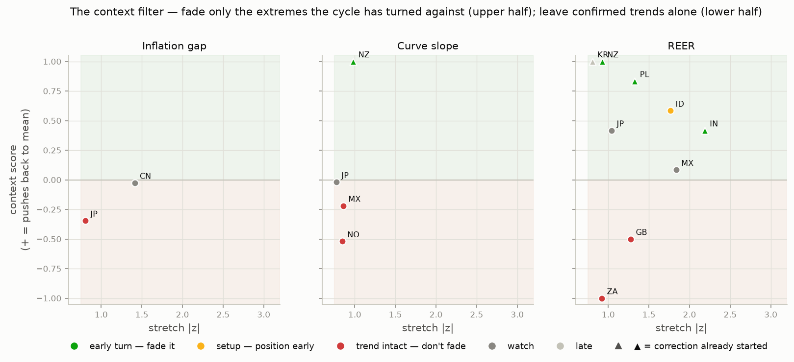

# DM + EM Cycle Monitor — 2026-07

*Generated 2026-08-28 by CycleAnalyzer. Data: BIS (policy rates, CPI, REER), OECD (composite leading indicators), FRED (10y yields). All signals are model output, not investment advice.*

**At a glance — the plays (elaborated in §7):**
1. New Zealand curve flattener
2. Long INR / short PLN
3. The fresh signal: India
4. The quiet carry: long MXN, because its cycle is not endangered
5. The reckoning trade: New Zealand front end is mispriced

## 1. Where the world is on the clock

The global pack: **5 central banks easing, 9 on hold, 10 hiking** — median policy move over 6 months +0.00pp.

**Overheating**: 11 · **Stagflation**: 6 · **Goldilocks**: 3 · **Disinflation**: 3

| Economy | Bloc | Growth z | Infl z | Phase | Heading | ETA next |
|---|---|---|---|---|---|---|
| Euro area | DM | -0.3 | +0.5 | **Stagflation** | ← Overheating | ~16m |
| Norway | DM | -0.2 | +1.1 | **Stagflation** | ← Overheating | ~4m |
| United Kingdom | DM | +0.2 | +0.4 | **Overheating** | → Stagflation | slow |
| New Zealand | DM | +0.4 | +0.5 | **Overheating** | ← Goldilocks | ~41m |
| United States | DM | +1.0 | +1.2 | **Overheating** | ← Goldilocks | ~5m |
| Australia | DM | +1.2 | +0.9 | **Overheating** | ← Goldilocks | ~12m |
| Canada | DM | +1.2 | +0.8 | **Overheating** | → Stagflation | ~17m |
| Japan | DM | +0.4 | -0.4 | **Goldilocks** | ← Disinflation | ~4m |
| Sweden | DM | +0.0 | -0.7 | **Goldilocks** | → Overheating | ~34m |
| Switzerland | DM | -0.1 | -0.4 | **Disinflation** | → Goldilocks | ~3m |
| Czechia | EM | -0.4 | +0.1 | **Stagflation** | → Disinflation | ~11m |
| Colombia | EM | -0.5 | +0.9 | **Stagflation** | → Disinflation | ~7m |
| Poland | EM | -0.1 | +0.2 | **Stagflation** | → Disinflation | ~21m |
| Chile | EM | -0.0 | +0.4 | **Stagflation** | → Disinflation | ~4m |
| Turkiye | EM | +0.1 | +1.3 | **Overheating** | ← Goldilocks | slow |
| Indonesia | EM | +0.0 | +0.3 | **Overheating** | → Stagflation | ~1m |
| Mexico | EM | +1.5 | +0.6 | **Overheating** | ← Goldilocks | ~5m |
| Brazil | EM | +1.8 | +0.7 | **Overheating** | ← Goldilocks | ~4m |
| Korea | EM | +2.3 | +0.8 | **Overheating** | → Stagflation | ~20m |
| South Africa | EM | +0.3 | +0.0 | **Overheating** | → Stagflation | ~28m |
| India | EM | +0.6 | -0.0 | **Goldilocks** | → Overheating | ~1m |
| China | EM | -0.6 | -1.3 | **Disinflation** | ← Stagflation | ~21m |
| Hungary | EM | -0.6 | -0.2 | **Disinflation** | → Goldilocks | slow |

*Phases rotate Goldilocks → Overheating → Stagflation → Disinflation. ETA is the model's months-to-next-quadrant at the current rotation speed; '·' or 'slow' = effectively parked.*

## 2. Mean reversion: how stretched, how fast it snaps back

Every cycle variable is fit as an Ornstein–Uhlenbeck process; the half-life says how quickly deviations decay, the z-score how far we are from equilibrium, and the projected path when (if ever) the **inflation-fight threshold (+1σ)** or **recession zone (−1σ)** is hit.

| Economy | Infl level (z) | OU stretch | HL (m) | Inflation fight | Growth level (z) | Recession risk |
|---|---|---|---|---|---|---|
| Euro area | +0.4 | +0.3 | 27 | 🟡 watch | -0.3 | 🟢 not in danger |
| Norway | +0.6 | +0.3 | 8 | 🟡 watch | -0.2 | 🟠 ~18m away |
| United Kingdom | +0.3 | -0.1 | 26 | 🟡 watch | +0.2 | 🟠 ~17m away |
| New Zealand | +1.0 | +0.5 | 18 | 🔴 in the zone | +0.4 | 🟠 ~4m away |
| United States | +0.7 | +0.2 | 13 | 🟡 watch | +1.0 | 🟢 not in danger |
| Australia | +0.9 | +0.7 | 14 | 🟡 watch | +1.2 | 🟢 not in danger |
| Canada | +0.7 | +0.5 | 10 | 🟡 watch | +1.2 | 🟢 not in danger |
| Japan | -0.1 | +0.8 | 22 | 🟠 ~13m away | +0.4 | 🟢 not in danger |
| Sweden | -0.6 | -0.3 | 28 | 🟡 watch | +0.0 | 🟢 not in danger |
| Switzerland | -0.6 | -0.0 | 20 | 🟢 not in danger | -0.1 | 🟠 ~12m away |
| Czechia | -0.1 | -0.3 | 42 | 🟢 not in danger | -0.4 | 🟢 not in danger |
| Colombia | +1.0 | +0.3 | 71 | 🔴 in the zone | -0.5 | 🟠 ~5m away |
| Poland | +0.1 | -0.1 | 59 | 🟢 not in danger | -0.1 | 🟢 not in danger |
| Chile | +0.2 | -0.1 | 33 | 🟢 not in danger | -0.0 | 🟢 not in danger |
| Turkiye | +1.2 | +0.4 | 53 | 🔴 in the zone | +0.1 | 🟢 not in danger |
| Indonesia | +0.2 | -0.2 | 9 | 🟠 ~15m away | +0.0 | 🟠 ~6m away |
| Mexico | +0.1 | -0.6 | 28 | 🟢 not in danger | +1.5 | 🟢 not in danger |
| Brazil | +0.6 | -0.3 | 42 | 🟡 watch | +1.8 | 🟢 not in danger |
| Korea | +0.6 | +0.5 | 17 | 🟠 ~15m away | +2.3 | 🟢 not in danger |
| South Africa | +0.4 | +0.1 | 19 | 🟠 ~2m away | +0.3 | 🟠 ~19m away |
| India | +0.2 | -0.4 | 11 | 🟠 ~6m away | +0.6 | 🟢 not in danger |
| China | -1.9 | -1.4 | 17 | 🟢 not in danger | -0.6 | 🟡 watch |
| Hungary | -0.3 | -0.3 | 54 | 🟢 not in danger | -0.6 | 🟡 watch |

**Cycles NOT in danger** (model path stays clear of both thresholds over 36 months): **Mexico**, **Poland**, **Czechia**, **Chile**. These are the economies where you can still be paid for the benign part of the cycle — credit and carry — without fighting the clock.

## 3. The context filter: which extremes to fade — and which to leave alone

**Mean reversion alone is a bad idea.** A z-score says a variable is far from equilibrium; it says nothing about whether the forces that created the extreme are done. Every stretched variable is therefore cross-examined against the *prevailing context* — leading growth momentum, the policy direction, real-rate restrictiveness, the clock heading — and against its own turn evidence, and only then classified:

- **EARLY TURN** — the correction has begun but has retraced only a fraction of the extreme, *and* the context says the cycle change is coming anyway. This is the best entry: you are not calling the top, the top is already in, and you are riding the rest of the reversion.
- **SETUP** — the series itself is still pinned at the extreme, but the leading indicators are deteriorating hard from the top. The counter-movement has not printed yet — position before it does.
- **TREND INTACT** — stretched, but the context still *feeds* the deviation (an early hiking cycle behind a rich currency, accelerating growth behind a hot inflation gap). **Do not fade.** The extreme can get more extreme; the statistical pull earns zero weight in the trade models until the context breaks.
- **LATE** — the reversion has mostly happened; the edge is gone.

| Economy | Variable | Stretch | Turning? | Retraced | Context | Verdict |
|---|---|---|---|---|---|---|
| India | REER | -2.2σ | yes | 20% | +0.42 | **EARLY TURN** |
| Poland | REER | +1.3σ | yes | 31% | +0.83 | **EARLY TURN** |
| New Zealand | REER | -1.0σ | yes | 27% | +1.00 | **EARLY TURN** |
| New Zealand | curve slope | +0.9σ | yes | 14% | +1.00 | **EARLY TURN** |
| Indonesia | REER | -1.7σ | no | 0% | +0.58 | **SETUP** |
| Korea | REER | -1.1σ | no | 21% | +1.00 | **SETUP** |
| Korea | curve slope | +0.8σ | no | 0% | +1.00 | **SETUP** |
| Hungary | REER | +0.8σ | no | 19% | +1.00 | **SETUP** |
| Hungary | curve slope | -0.8σ | no | 0% | +1.00 | **SETUP** |
| United Kingdom | REER | +1.2σ | no | 5% | -0.50 | **TREND INTACT** |
| Mexico | curve slope | +1.0σ | no | 0% | -0.22 | **TREND INTACT** |
| South Africa | REER | +0.9σ | no | 0% | -1.00 | **TREND INTACT** |
| Norway | curve slope | -0.9σ | no | 28% | -0.52 | **TREND INTACT** |
| Japan | inflation gap | +0.8σ | no | 40% | -0.45 | **TREND INTACT** |
| Poland | curve slope | +0.8σ | no | 27% | -0.76 | **TREND INTACT** |
| Mexico | REER | +1.9σ | no | 10% | +0.08 | **WATCH** |
| China | inflation gap | -1.4σ | no | 20% | +0.01 | **WATCH** |
| Japan | REER | -1.2σ | no | 3% | +0.42 | **WATCH** |
| Colombia | REER | +0.8σ | no | 0% | -0.08 | **WATCH** |

*Context > 0 means the surrounding cycle pushes the variable back toward its mean; < 0 means the context still supports the extreme. Retraced = how much of the last 12 months' peak deviation is already unwound — early turns (< 40%) are entries, late ones are exits.*

## 4. What stands out vs the global cycle

- **Turkiye** — TCMB's real rate is +6.8pp above its own decade norm — most room in the universe to ease without stoking inflation.
- **Hungary** — MNB's real rate is +6.5pp above its own decade norm — most room in the universe to ease without stoking inflation.
- **Colombia** — BanRep moved 2.8pp tighter than the global median over 6m.
- **New Zealand** — RBNZ runs a NEGATIVE real rate (-1.8%) with inflation +2.1pp above target — behind the curve.
- **Brazil** — BCB's real rate is +4.3pp above its own decade norm — most room in the universe to ease without stoking inflation.
- **Sweden** — Riksbank's real rate is +3.5pp above its own decade norm — most room in the universe to ease without stoking inflation.
- **India** — RBI on hold 6m with inflation +0.4pp above target and rising — the debate shifts toward a hike while others are neutral.
- **Canada** — BoC runs a NEGATIVE real rate (-0.8%) with inflation +1.0pp above target — behind the curve.
- **Euro area** — ECB runs a NEGATIVE real rate (-0.7%) with inflation +0.9pp above target — behind the curve.
- **United Kingdom** — BoE's real rate is +2.1pp above its own decade norm — most room in the universe to ease without stoking inflation.

## 5. Yield curves

| Economy | Slope (pp) | z | HL (m) | Phase | Call | Why |
|---|---|---|---|---|---|---|
| Mexico | +2.95 | +1.0 | 7 | Overheating | **flattener** (★★) | phase 'Overheating' implies flatter; Banxico is cutting (-0.50pp/6m), which works through the front end; slope +1.0σ vs own history (half-life 7m) — mean reversion leans against; context filter: TREND_INTACT — the extreme is CONFIRMED by the prevailing context — the forces that created it are still in place; do not fade this on statistics alone |
| New Zealand | +2.21 | +0.9 | 38 | Overheating | **flattener** (★★) | phase 'Overheating' implies flatter; RBNZ is hiking (+0.25pp/6m), which works through the front end; context filter: EARLY_TURN — the correction has started but only 14% of the extreme is unwound, and the surrounding cycle context points the same way — the rest of the move is the trade |
| Korea | +1.68 | +0.8 | 19 | Overheating | **flattener** (★★) | phase 'Overheating' implies flatter; BoK is hiking (+0.25pp/6m), which works through the front end; context filter: SETUP — the level itself has not budged, but the leading context is breaking against it hard — position for the counter-movement before it shows in the series |
| Hungary | -0.99 | -0.8 | 20 | Disinflation | **steepener** (★★) | phase 'Disinflation' implies steeper; MNB is cutting (-0.75pp/6m), which works through the front end; context filter: SETUP — the level itself has not budged, but the leading context is breaking against it hard — position for the counter-movement before it shows in the series |
| Switzerland | +0.31 | -0.7 | 21 | Disinflation | **steepener** (★★) | phase 'Disinflation' implies steeper |
| United States | +0.84 | -0.3 | 36 | Overheating | **flattener** (★★) | phase 'Overheating' implies flatter |
| South Africa | +1.70 | -0.3 | 36 | Overheating | **flattener** (★★) | phase 'Overheating' implies flatter; SARB is hiking (+0.25pp/6m), which works through the front end |
| Canada | +1.17 | +0.2 | 34 | Overheating | **flattener** (★★) | phase 'Overheating' implies flatter |
| Australia | +0.48 | -0.1 | 16 | Overheating | **flattener** (★★) | phase 'Overheating' implies flatter; RBA is hiking (+0.75pp/6m), which works through the front end |
| United Kingdom | +1.05 | +0.0 | 34 | Overheating | **flattener** (★★) | phase 'Overheating' implies flatter |
| Norway | -0.05 | -0.9 | 21 | Stagflation | **steepener** (★) | phase 'Stagflation' implies steeper; Norges Bank is hiking (+0.25pp/6m), which works through the front end; context filter: TREND_INTACT — the extreme is CONFIRMED by the prevailing context — the forces that created it are still in place; do not fade this on statistics alone |
| Poland | +1.76 | +0.8 | 11 | Stagflation | **steepener** (★) | phase 'Stagflation' implies steeper; NBP is cutting (-0.25pp/6m), which works through the front end; context filter: TREND_INTACT — the extreme is CONFIRMED by the prevailing context — the forces that created it are still in place; do not fade this on statistics alone |
| Japan | +1.67 | +0.5 | 34 | Goldilocks | **steepener** (★) | phase 'Goldilocks' implies steeper; BoJ is hiking (+0.25pp/6m), which works through the front end |
| Chile | +1.02 | +0.3 | 30 | Stagflation | **steepener** (★) | phase 'Stagflation' implies steeper |
| Euro area | +1.22 | -0.2 | 29 | Stagflation | **steepener** (★) | phase 'Stagflation' implies steeper; ECB is hiking (+0.25pp/6m), which works through the front end |
| Sweden | +1.03 | +0.2 | 24 | Goldilocks | **steepener** (★) | phase 'Goldilocks' implies steeper |
| Czechia | +0.95 | -0.0 | 39 | Stagflation | **steepener** (★) | phase 'Stagflation' implies steeper; CNB is hiking (+0.25pp/6m), which works through the front end |

## 6. FX scorecard

Each currency is scored against the USD as the sum of five engines — **carry + cycle + valuation + momentum − penalty**. The engines are deliberately built on *different* sources of return, so their sum is less about magnitude than about **agreement**: any single engine can be wrong for a year, but a currency where four pull the same way is wrong far less often. The components are scaled to comparable size (each contributes roughly ±0.5 to ±1.5), so a total above ≈ +1 is a serious long candidate and anything below ≈ −0.5 is funding-leg material.

### 6.1 The five engines, one by one

**Carry** — `0.25 × (policy rate − US policy rate), clipped at ±6pp; halved when the inflation gap eats the whole pickup (real pickup < 0)`

*What it measures.* The annualized interest differential you are paid — or pay — just for holding the currency versus USD, before anything moves. It is the only component that accrues to you every day the view is *wrong but not very wrong*.

*Where the edge lies.* Uncovered interest parity says forwards should price away the differential, so carry should net to zero. Empirically it does not — the forward premium puzzle: high-carry currencies depreciate less, on average, than their forwards imply, so rolling forwards harvests a persistent risk premium. That premium is compensation for crash risk: you collect it in calm regimes and give a slice back in risk-off. The model's refinement is that *nominal* carry which merely compensates for higher inflation is not edge at all — it is the currency's expected depreciation in disguise — hence the haircut when the inflation gap swallows the pickup, and the separate penalty beyond that.

*Where it fails:* in global vol spikes: carry is a crowded trade and unwinds violently, all pairs at once, regardless of local merit.

**Cycle** — `phase value (Overheating +0.9, Goldilocks +0.6, Stagflation −0.6, Disinflation −0.9) × cycle amplitude (capped 1.5) × 0.5; when the clock's ETA to the next phase ≤ 9 months, half the weight shifts to the *destination* phase`

*What it measures.* Where the economy sits on the clock, and — more importantly — where it is rotating to. Overheating and Goldilocks attract capital: rate expectations climb, equity and credit inflows follow. Stagflation and Disinflation repel it: cuts are coming, growth is going.

*Where the edge lies.* Markets are good at pricing the central bank's *last* move and bad at pricing the *rotation*. A currency entering Overheating will receive hikes that are not yet in the forwards; one rolling into Disinflation will receive cuts that are not either. The heading blend is deliberate: when rotation is fast you want to own the currency for what the cycle is about to do, not for where it stands. Amplitude scaling keeps direction honest — an economy hovering near the origin of the clock has a direction but no cycle, and direction without amplitude is noise.

*Where it fails:* when a supply shock masquerades as a cycle phase: oil-shock stagflation is bullish for an oil exporter's currency and bearish for an importer's, and the clock cannot tell them apart.

**Valuation** — `−0.45 × REER deviation from its 10y average (z, clipped ±2.5), multiplied by the context-filter gate: ×1.25 on EARLY TURN, ×1.0 on SETUP, ×0.5 on WATCH, ×0.3 on LATE, ×0 on TREND INTACT`

*What it measures.* How rich or cheap the currency is in *real, trade-weighted* terms — the BIS broad REER against its own decade. Real, so inflation differentials are already netted out; effective, so it measures competitiveness against all partners, not just the dollar.

*Where the edge lies.* Real exchange rates mean-revert over multi-year horizons through the competitiveness channel: a persistently rich currency erodes exports and the current account until the currency itself gives way, and vice versa. But the half-lives are long, which is exactly why this component is the one the context filter polices hardest: a cheap currency whose central bank is cutting into a slowdown is cheap *for a reason* and earns nothing (TREND INTACT ×0); the same cheapness with the correction already underway and the cycle turning earns a premium (EARLY TURN ×1.25). Valuation is edge only near turning points — the gate is what turns a slow anchor into a timing-aware signal.

*Where it fails:* when the fair value itself moves: a terms-of-trade regime shift (commodity supercycle, an energy transition) makes the 10-year mean stale, and the model will call 'rich' what is actually a new equilibrium.

**Momentum** — `policy direction: hiking +0.4, on hold 0, cutting −0.4; +0.2 bonus for hiking while inflation momentum is already falling`

*What it measures.* Which way the central bank is actually moving right now — not the level of rates (that is carry) but the direction of travel.

*Where the edge lies.* Policy cycles persist: hikes cluster, cuts cluster, and the first move is rarely the last, while FX over one-to-six-month horizons follows the *change* in rate differentials more than the level. The bonus case is deliberate and is the strongest single configuration in the stack: a bank hiking while inflation already falls is delivering rising *real* rates — the currency gets the differential and the credibility at once.

*Where it fails:* at the end of the cycle: the last hike is historically a sell signal, not a buy — the clock and the danger model are the overlays meant to catch the turn this component misses.

**Penalty** — `−0.6 per pp of inflation gap beyond +2pp above target, capped at −3`

*What it measures.* A credibility discount, not a return forecast. Beyond a couple of points above target, inflation stops being an input to carry and becomes the whole story: pass-through accelerates, expectations de-anchor, and the real value of the carry collapses faster than the nominal rate can compensate.

*Where the edge lies.* The edge here is *avoidance*: the cap at −3 encodes that past a point the right reading is 'uninvestable', not 'great short'. Shorting a 30–40% yielder pays ruinous negative carry, so a broken-credibility currency is excluded from the crosses on *both* sides — you neither hold it for the carry trap nor short it for the bleed. It re-enters the tradable universe only when disinflation is delivered, at which point the (still huge) carry starts counting again.

*Where it fails:* at the moment of a credible stabilization: the penalty lags the regime change, and the first year of a successful disinflation is historically the best carry trade there is.

### 6.2 How to read the sum

- **The edge is in the agreement structure, not the total.** Carry confirmed by cycle and momentum — being paid to hold a currency whose central bank is hiking into an overheating economy — is the strongest configuration in the framework. Carry *against* cycle (a high yielder rolling into Disinflation, where the coming cuts will eat the differential) is the classic carry trap, and the sum catches it automatically because the cycle term goes negative before the carry term does.
- **A single-engine score is a watchlist item, not a trade.** A total driven by valuation alone is precisely the 'mean reversion alone' mistake the context filter exists to block; a total driven by carry alone deserves a credibility check before anything else.
- **Why crosses instead of USD legs.** The scores are measured vs USD, but the cleanest expression pairs the strongest long against the weakest *credible* funder: the dollar — with its own cycle, its own politics — nets out, leaving a pure relative-cycle position that is *paid* the carry differential to wait.
- **The penalty is a filter, not a signal.** A deeply negative penalty (TRY-style) removes the currency from both sides of the book: the carry is uncollectible and the short bleeds. Uninvestable is a verdict too.

**Worked example — INR, this month's top score (+1.86):** carry +0.41 from a +1.6pp policy-rate pickup over USD; cycle +0.22 from sitting in Goldilocks and heading to Overheating in ~1m; valuation +1.23 from a REER -2.2σ vs its decade, credited because the context verdict is EARLY_TURN; momentum +0.00 because RBI is on hold. 3 engines pull the same way and none pulls against — and the dominant engine, valuation, only counts because the context filter licensed it (EARLY TURN), which is what separates this from a naive value trade. The agreement structure, not any single number, is the trade.

### 6.3 The scorecard

| Ccy | Carry | Cycle | Valuation | Momentum | Penalty | **Total** |
|---|---|---|---|---|---|---|
| INR | +0.41 | +0.22 | +1.23 | +0.00 | -0.00 | **+1.86** |
| BRL | +1.50 | +0.56 | +0.08 | -0.40 | -0.00 | **+1.74** |
| IDR | +0.53 | +0.02 | +0.74 | +0.40 | -0.00 | **+1.69** |
| KRW | -0.11 | +0.68 | +0.50 | +0.40 | -0.00 | **+1.47** |
| ZAR | +0.84 | +0.14 | -0.00 | +0.40 | -0.00 | **+1.38** |
| AUD | +0.09 | +0.67 | -0.04 | +0.60 | -0.00 | **+1.32** |
| NZD | -0.14 | +0.30 | +0.56 | +0.40 | -0.03 | **+1.09** |
| CAD | -0.17 | +0.65 | +0.26 | +0.00 | -0.00 | **+0.74** |
| COP | +1.50 | -0.38 | -0.18 | +0.40 | -0.62 | **+0.72** |
| NOK | +0.08 | +0.08 | -0.16 | +0.60 | -0.00 | **+0.60** |
| MXN | +0.72 | +0.56 | -0.42 | -0.40 | -0.00 | **+0.46** |
| CZK | +0.03 | -0.12 | -0.13 | +0.60 | -0.00 | **+0.38** |
| JPY | -0.33 | -0.04 | +0.27 | +0.40 | -0.00 | **+0.30** |
| GBP | +0.02 | +0.19 | -0.00 | +0.00 | -0.00 | **+0.21** |
| CLP | +0.22 | -0.14 | +0.11 | +0.00 | -0.00 | **+0.19** |
| EUR | -0.17 | -0.17 | -0.10 | +0.60 | -0.00 | **+0.16** |
| SEK | -0.23 | +0.22 | -0.09 | +0.00 | -0.00 | **-0.10** |
| CHF | -0.45 | -0.03 | +0.07 | +0.00 | -0.00 | **-0.41** |
| THB | -0.33 | +0.00 | +0.32 | -0.40 | -0.00 | **-0.41** |
| CNY | -0.08 | -0.62 | +0.17 | +0.00 | -0.00 | **-0.53** |
| HUF | +0.53 | -0.30 | -0.36 | -0.40 | -0.00 | **-0.53** |
| TRY | +1.50 | +0.58 | -0.14 | +0.00 | -3.00 | **-1.06** |
| PLN | +0.02 | -0.05 | -0.75 | -0.40 | -0.00 | **-1.18** |

Model crosses (strongest long vs weakest *credible* funder):
- **Long INR / short PLN** — edge +3.04. buy INR, sell PLN via 3m FX forwards (rolled); indicative positive carry ≈ +1.5pp annualized from the policy-rate differential
- **Long BRL / short HUF** — edge +2.27. buy BRL, sell HUF via 3m FX forwards (rolled); indicative positive carry ≈ +8.5pp annualized from the policy-rate differential
- **Long IDR / short CNY** — edge +2.22. buy IDR, sell CNY via 3m FX forwards (rolled); indicative positive carry ≈ +2.8pp annualized from the policy-rate differential

## 7. What is most interesting to play right now

### 7.1 New Zealand curve flattener

The New Zealand 10y−policy slope sits at +2.21pp (+0.9σ vs its own history, half-life 38m). The economy is in **Overheating**, which pushes the slope flatter, and RBNZ is hiking (+0.25pp over 6m at 2.50%) — policy moves hit the front end first, which is exactly the flattening force. Crucially, the move has *already started* but only 14% of the extreme is retraced — you are not calling the turn, the turn is in, and the context says the rest is coming. Why not Mexico, whose slope is more stretched (+1.0σ)? Because its stretch is TREND INTACT — Banxico is still cutting, which keeps feeding the steepness — and a confirmed trend is precisely the extreme this framework refuses to fade on statistics alone.

**How to express it:** 2s10s flattener in NZD: pay 2y swap (or short 2y govvies / front-end futures), receive 10y — DV01-neutral, so the P&L is the slope, not the level.

**Context check:** stretch +0.9σ, already turning, 14% retraced; context score +1.00 → **EARLY_TURN**: the correction has started but only 14% of the extreme is unwound, and the surrounding cycle context points the same way — the rest of the move is the trade.

*Risk:* a growth shock flips the phase to Disinflation and the trade inverts; size for the 38m half-life, not for a month.

### 7.2 Long INR / short PLN

The widest credible gap in the FX scorecard (+3.04). INR: carry +0.41, cycle +0.22 (Goldilocks, heading Overheating), REER valuation +1.23. PLN: cycle -0.05 (Stagflation), valuation -0.75, momentum -0.40 — a funding currency whose central bank is easing or parked while the long leg's cycle still supports rates. Why the cross and not two USD legs: pairing them nets out the dollar, so the position is a pure relative-cycle bet with the carry differential on your side.

**How to express it:** buy INR, sell PLN via 3m FX forwards (rolled); indicative positive carry ≈ +1.5pp annualized from the policy-rate differential.

**Context check:** long leg REER: stretch -2.2σ, already turning, 20% retraced; context score +0.42 → **EARLY_TURN**: the correction has started but only 20% of the extreme is unwound, and the surrounding cycle context points the same way — the rest of the move is the trade. Short leg REER: stretch +1.3σ, already turning, 31% retraced; context score +0.83 → **EARLY_TURN**: the correction has started but only 31% of the extreme is unwound, and the surrounding cycle context points the same way — the rest of the move is the trade.

*Risk:* a global risk-off compresses EM carry crosses regardless of local cycles; the short leg rallies on safe-haven flows.

### 7.3 The fresh signal: India

RBI on hold 6m with inflation +0.4pp above target and rising — the debate shifts toward a hike while others are neutral. This is the 'one fresh signal' class of trade: the market prices the pack, not the outlier, so the repricing when the outlier confirms is asymmetric — small loss if it stays parked, large gain if it moves.

**How to express it:** pay 1y–2y INR swaps — the hike is not priced while the pack is neutral — and lean long INR vs USD via 3m forwards as the second leg.

**Context check:** this is a divergence/momentum trade, not a fade: the OU path crosses the fight line in ~6 months, with inflation momentum +1.0pp over 3m — the context is moving *with* the position, which is what the filter requires when there is no extreme to revert.

*Risk:* single-meeting risk — one CPI print or one MPC vote can void the divergence; keep it tactical.

### 7.4 The quiet carry: long MXN, because its cycle is not endangered

Mexico is the model's cleanest 'nothing breaks here' story: the OU projection keeps both the inflation gap and the growth cycle clear of danger thresholds for the whole 36-month horizon (phase: Overheating). When the cycle is far from endangered you are being paid carry without paying cycle risk — this is where 'we are ok with credit' applies: local-currency duration and credit both clip coupon while the clock stands still.

**How to express it:** long MXN vs USD via rolled 3m forwards (carry ≈ +2.9pp over USD), and/or unhedged local-currency 2–5y government bonds — the belly, not the long end, so the position is carry, not a duration view.

**Context check:** stretch +1.9σ, still pinned at the extreme; context score +0.08 → **WATCH**: stretched, but turn evidence and context are both mixed.

*Risk:* the safety is model-projected, not guaranteed; a supply-side inflation shock (energy, food, FX pass-through) is exactly what an OU model cannot see coming.

### 7.5 The reckoning trade: New Zealand front end is mispriced

A central bank holding a negative real rate (-1.8%) with inflation +2.1pp above target and momentum +1.0pp/3m eventually validates the market's fear, not its hope. The trade is in the front end, not the currency: NZD is a second-order long *if* the bank moves, a short if it keeps refusing — so let rates carry the view. Note this is the same macro story as the curve trade above: the 2s10s flattener is the DV01-neutral version, paying 2y outright is the directional version — run one or the other, sized once, not both at full size.

**How to express it:** pay 2y NZD swap (or short 2y govvies / front-end futures); keep duration elsewhere until the front end reprices the hikes.

**Context check:** this is a divergence/momentum trade, not a fade: already inside the inflation-fight zone, with inflation momentum +1.0pp over 3m — the context is moving *with* the position, which is what the filter requires when there is no extreme to revert.

*Risk:* the bank may be right — if growth cracks first, inflation dies on its own and paying the front end loses.

## 8. Phase playbook (reference)

- **Goldilocks** (Japan, Sweden, India): credit-friendly: carry works, curve gently steepens, currency supported
- **Overheating** (United States, United Kingdom, Canada, Australia, New Zealand, Brazil, Mexico, South Africa, Turkiye, Indonesia, Korea): pre-hike: pay the front end, long the currency, flatteners
- **Stagflation** (Euro area, Norway, Poland, Czechia, Chile, Colombia): late-cycle: steepeners begin, currency vulnerable, own the peak-rates trade
- **Disinflation** (Switzerland, China, Hungary): easing: receive rates, bull steepeners, currency funds carry trades

## Appendix: methodology in one page

- **Clock**: growth z = OECD CLI deviation from 100 scaled by 15y dispersion; inflation z = CPI y/y minus CB target scaled likewise. Phase angle θ = atan2(infl, growth); rotation speed = median monthly Δθ over 9m.
- **Mean reversion**: AR(1)/OU fit per series; expected path blends OU decay with fading 3m momentum, producing the realistic rise-then-revert hump. Danger = projected path crossing ±1σ.
- **Context filter**: every |z| ≥ 0.75 stretch is cross-examined: turn evidence (3m drift back toward the mean, share of the 12m peak already retraced) and a context score built from leading-growth momentum, real-rate restrictiveness, policy direction and the clock heading. Verdicts gate the mean-reversion terms in the trade models: TREND INTACT zeroes them, EARLY TURN boosts them.
- **Standouts**: 6m policy change vs universe median (robust z via MAD), real-rate gap vs own decade, inflation momentum. Labels: early hiker, cutting-into-inflation, deliberating hike, behind the curve, room to cut.
- **FX score** = carry (haircut when inflation gap eats it) + clock phase (weighted toward the heading when rotation is fast) + REER mean-reversion pull + policy momentum − credibility penalty.
- **Curve call** = 0.6 × phase implication + 0.4 × OU stretch fade, weighted by reversion speed.
